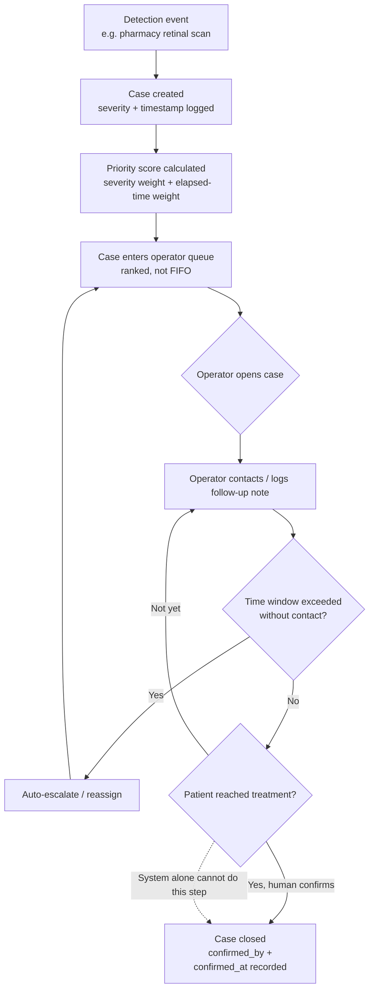
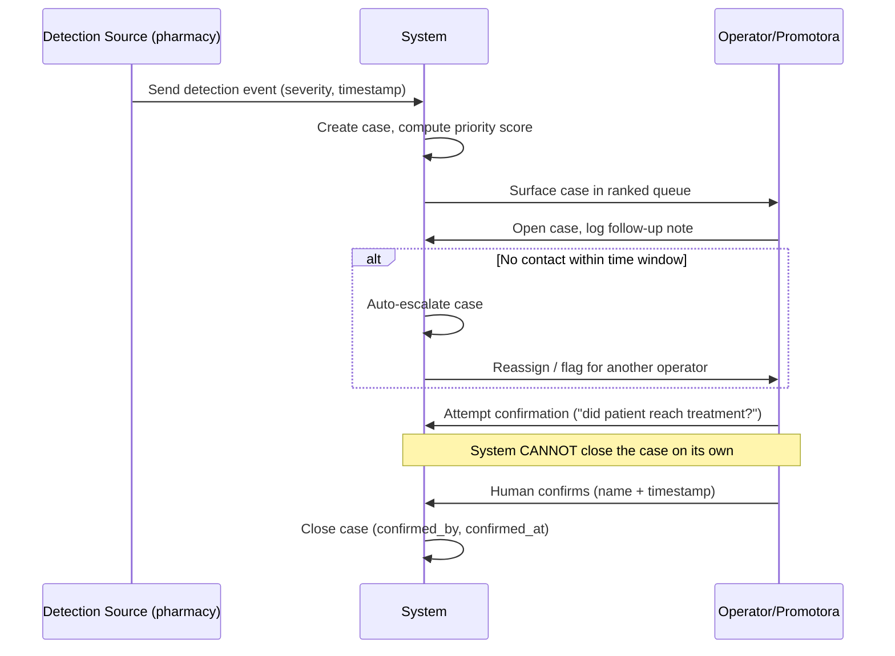

# PACKET.md — Week 5, Contactless Love (Chapter 4)
**Role: Technologist — Josep Ferré Gil**
**Team 7 · Primary vacuum: Catastrophic-Cost · My layer honors Condition 4 (Shadow Clause)**

---

## 1. Problem, in my own words

Detection is no longer the hard part in Mexico — PROSPERiA/retinIA already screens diabetic retinopathy at pharmacy level, for free. What breaks is everything *after* the positive result. A pharmacy scan flags a problem, and then the signal disappears into a fragmented public health system with no owner, no timeline, and no record of whether the patient ever got treated. If a pilot scales past a handful of cases, the single human meant to follow up (a promotora, a pharmacist) gets flooded with identical, unprioritized alerts — the same volume that made the signal useful now makes it noise, and cases silently go dark. Nobody decides that care should stop; it just does.

## 2. Exact user

**Primary user of this slice: the follow-up operator** — a pharmacy staffer or community health promotora who receives positive detection cases and is responsible for making sure each one reaches actual treatment.
**Secondary subject: the patient behind each case** (a Guadalupe-type profile — informal-sector, cost-sensitive) — she doesn't interact with this interface directly, but every design decision here exists to make sure she isn't the one who gets lost in the queue.

This is deliberately not a patient-facing product this week — that's the User role's slice. Mine is the connective tissue between detection and human follow-up.

## 3. Success definition

**Before the module closes:**
- A simulated detection event (severity + timestamp) automatically creates a case.
- Cases are ranked in a queue by a priority score combining **severity** and **elapsed time since detection** — not FIFO, not a flat alert list.
- An operator can view their queue, open a case, and add a follow-up note.
- **A case cannot be marked "closed" through any automated process.** Closing requires a human-entered confirmation field (`confirmed_by`, `confirmed_at`) — enforced at the database/API level, not just in the UI copy.
- If a case sits untouched past a configurable time window, it auto-escalates (reassigns or flags) instead of aging silently.

## 4. Mockup (image-generated)

**Screen to generate:** *Operator Case Queue* — a clean dashboard, mobile-first, showing:
- A ranked list of cases (patient initials only, severity badge, "days since detection" counter, priority score)
- Color-coded urgency (not a raw numeric score — operators shouldn't need to interpret math)
- One case expanded, showing a timeline (detected → prioritized → contacted → *[blocked: awaiting human confirmation]*)
- A visibly disabled "Close case" button until a "Confirm patient reached treatment" checkbox + operator name is filled — this is the Shadow Clause made visible in the UI itself, not just a backend rule.

*(I'll generate this with my LLM's built-in image generation and drop the PNG into `docs/mockup.png` before submitting — described here so the packet stands on its own.)*

## 5. Flow — Mermaid diagrams

### 5a. Flowchart

### 5b. Swimlane (multiple actors: Detection Source, System, Operator)

## 6. Benchmark line

The best existing solution on Earth for this is **Dimagi's CommCare** — an offline-first case-management platform already used by community health workers across India, Africa, and Latin America to follow patients from diagnosis through treatment in HIV and TB programs.

Mine differs by being purpose-built for Mexico's *private-detection-into-fragmented-public-system* handoff specifically, and by making the Shadow Clause — no automated case closure — a structural constraint of the data model rather than a configurable workflow choice, which CommCare leaves open to whoever builds on top of it.

## 7. Long-view paragraph (3 sentences)

In three years, this becomes the shared case-management layer that any detection source in Mexico — pharmacy retinal scans, blood pressure kiosks, a WhatsApp symptom bot — can plug a positive result into, and that any follow-up network — a pharmacist, an NGO promotora, a public clinic — can pull prioritized work from. It won't own the detection AI (already commodity) or the financial protection product (Money's job); it will be the accountability layer that keeps both honest, since no case can be marked solved without a named human witness. Success looks like invisible infrastructure — several unrelated detection and treatment programs relying on it the way payment processors are relied on without being noticed.

## 8. Scope cut — NOT building this week

- **Not** the detection AI itself (commodity — PROSPERiA/retinIA already exists).
- **Not** the financial protection / catastrophic-cost mechanism (Money's slice).
- **Not** a patient-facing app or Guadalupe's own interface (User's slice).
- **Not** real integration with an actual pharmacy chain or government health system — detection events are simulated and clearly labeled as such on screen.
- **Not** a full WhatsApp Business integration this week — noted as a fast-follow, not required for this slice.

## 9. Architecture + stack

| Layer | Choice | Why |
|---|---|---|
| Frontend | Next.js (React) on Vercel | Free tier, fast deploy, matches course stack |
| Auth | Supabase Auth ("Sign in with Google") | Required by Security Floor — no open door to case data |
| Database | Supabase (Postgres) | Row Level Security scoped per operator; native to course stack |
| Priority logic | Server-side function (Next.js API route or Supabase Edge Function) | `score = (severity_weight × severity) + (time_weight × hours_since_detection)` |
| Case closure guard | DB constraint / trigger requiring `confirmed_by` + `confirmed_at` before `status = 'closed'` | Enforces Shadow Clause at the data layer, not just the UI |
| Simulated detection input | A seed script / simple form mimicking a retinIA-style webhook payload | Labeled on screen as simulated |
| Escalation | Scheduled Supabase Edge Function checking `last_contacted_at` vs. time window | Auto-reassign without needing new staff (Condition 5) |

## 10. Test plan

**Mechanical pass:**
- Unit test: priority score returns higher rank for high-severity + long-elapsed cases over low-severity + recent ones.
- Integration test: seeding a detection event creates exactly one case with correct initial score.
- Integration test: attempting to close a case via API without `confirmed_by` populated is rejected (Shadow Clause enforcement).
- Integration test: a case untouched past the time window auto-escalates and reappears reassigned.
- Manual: RLS check — operator A cannot see or modify operator B's cases.

**Persona pass (Layer 1):**
- Synthetic persona: **a pharmacy-based promotora, mid-40s, manages ~15–20 cases a day, not a technical user, gets impatient with unclear UI.**
- Walk her through: opening the queue, understanding why one case ranks above another, attempting to close a case before confirming treatment (should be blocked and *understandable why*), handling an auto-escalated case.
- Log every point of hesitation or misunderstanding; fix the worst one before deadline.
